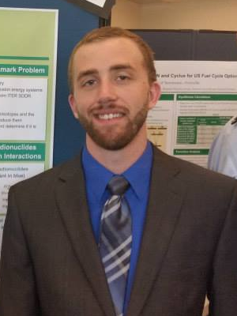

Lucas J. Jacobson
===============

Contact Information
-------------------

| 428 Engineering Research Building
| 1500 Engineering Drive
| Madison, WI 53706
| ljjacobson@wisc.edu

----

Research Interests
------------------

* Monte Carlo methods
* Radiation transport
* Hybrid activation methods
* High performance computing
* Scientific software development

Projects
--------

* Investigated and implemented new techniques to improve the efficiency of the Multi-Step Consistent Adjoint-Driven Importance Sampling (MS-CADIS) method, a variance reduction technique designed chiefly to speed up shutdown dose rate analysis

  * work done with the Radiation Transport group at Oak Ridge National Laboratory

* Implemented a parallel version of the activation analysis code `ALARA <https://github.com/svalinn/ALARA>`_ using OpenMP
* Investigated the viability of using the CAD-based Monte Carlo radiation transport toolkit `DAGMC <https://github.com/svalinn/DAGMC>`_ to model spacer grids in light water reactors to gain insight
* Devised a validation and verification and regression testing framework for DAGMC
* Conducted a parametric timing study to compare the computational efficiency of DAG-MCNP5 with that of native MCNP5

Education 
---------

* University of Wisconsin--Madison [Ph.D. in Nuclear Engineering and Engineering Physics, current]
* University of Wisconsin--Madison [M.S. in Nuclear Engineering and Engineering Physics, 2014]
* University of Wisconsin--Madison [B.S. in Nuclear Engineering, 2014]
* Oak Creek High School [valedictorian, 2009]
