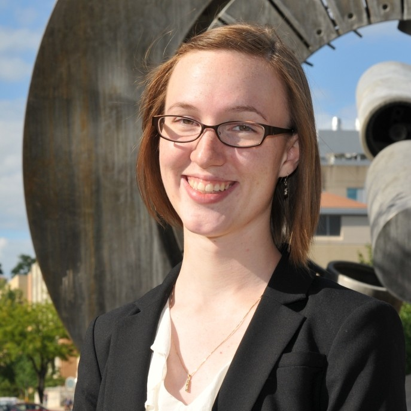

Kalin R. Kiesling
===================

Contact Information
--------------------

| 428 Engineering Research Building
| 1500 Engineering Drive
| Madison, WI 53706

| `kkiesling@wisc.edu <mailto:kkiesling@wisc.edu>`_
| `krkiesling@gmail.com <mailto:krkiesling@gmail.com>`_

Find me on:
|gh_icon|_
|bb_icon|_
|li_icon|_

Research Interests
-------------------

 * Software development for neutronics applications
 * Scientific computing

Education
----------

 * University of Wisconsin, Madison, WI [current PhD Nuclear Engineering & Engineering Physics]
 * University of Wisconsin, Madison, WI [MS Nuclear Engineering & Engineering Physics, 2015]
 * University of Wisconsin, Madison, WI [BS Nuclear Engineering, 2nd major Spanish Language, 2015]
 * University of Wisconsin, Madison, WI [Certificate in International Engineering, 2012]

.. |gh_icon| image:: github.png
              :width: 32
.. _gh_icon: https://github.com/kkiesling

.. _bb_icon: https://bitbucket.com/kkiesling

.. |li_icon| image:: linkedin.png
              :width: 32
.. _li_icon: https://www.linkedin.com/in/kalin-kiesling-32921951
