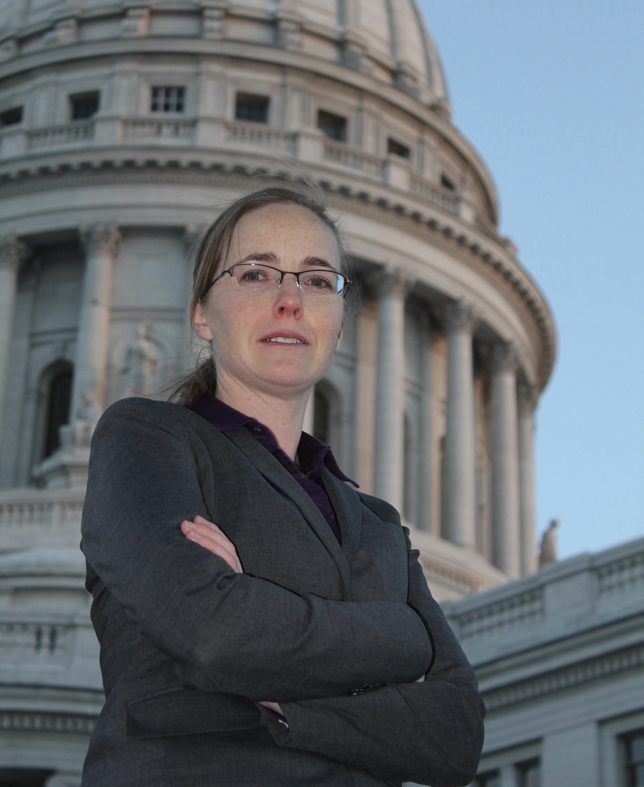
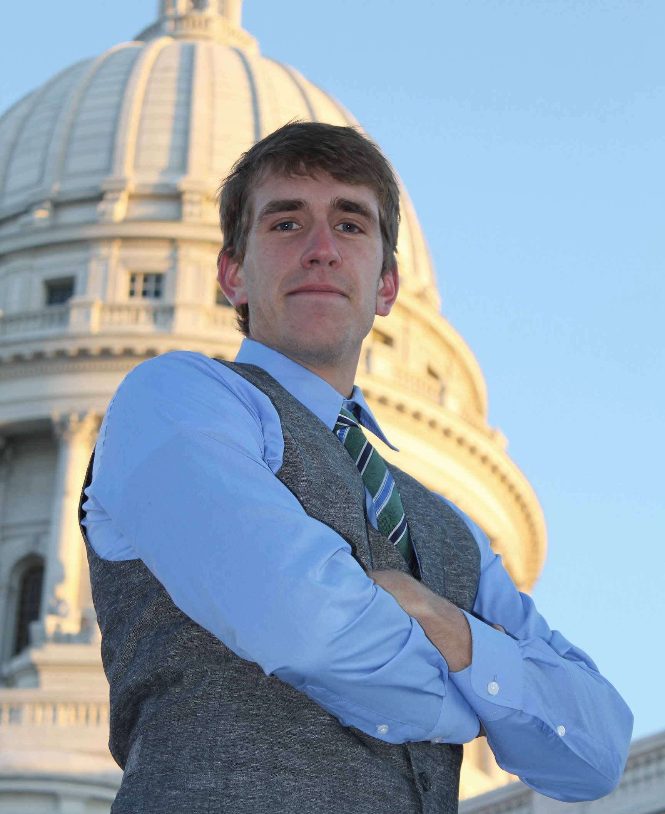
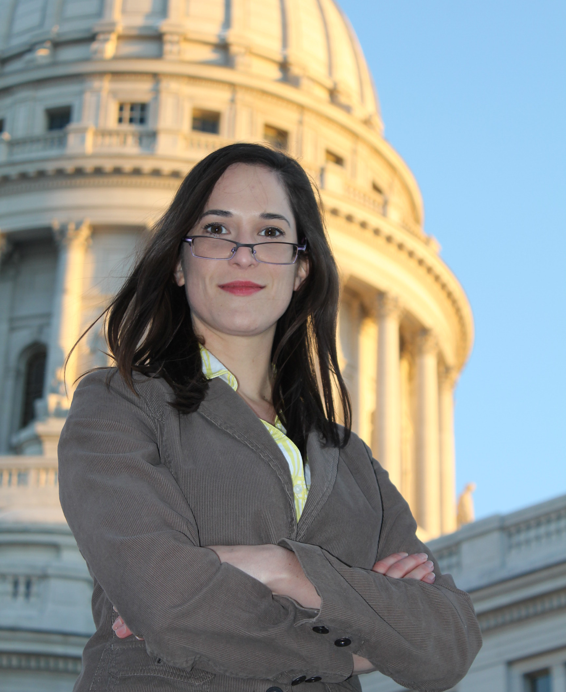

Staff and Students
==========================

Research Staff
--------------

+-----------------------------------------------+--------------------+---------------------------------------------+----------------------------------+----------------------------+
| |pphw_img|                                    | |dlh_img|          | |ad_img|                                    | |as_img|                         | |jz_img|                   |
| :doc:`Paul Wilson <pphw>`, CNERG group leader | Douglass Henderson | :doc:`Andrew Davis <adavis>`, Andrew Davis  | :doc:`Anthony Scopatz <scopatz>` | :doc:`Julie Zachman <jcz>` |
+-----------------------------------------------+--------------------+---------------------------------------------+----------------------------------+----------------------------+

.. |pphw_img| image:: pphw2.jpg
              :width: 100

.. |dlh_img| image:: capitol_blank.JPG
             :width: 100

.. |ad_img| image:: capitol_davis.JPG
             :width: 100

.. |as_img| image:: capitol_blank.JPG
             :width: 100

.. |jz_img| image:: jcz.jpg
             :width: 100

Postdocs
--------

+---------------------------------+
| |mbm_img|                       |
|                                 |
| :doc:`Meghan McGarry <mcgarry>` |
+---------------------------------+

Graduate Students
-----------------

+----------------------------------+------------------------------------+----------------------------------+---------------------------------+---------------------------------------+
| |kld_img|                        | |mjg_img|                          | |edb_img|                        | |rwc_img|                       | |cad_img|                             |  
| :doc:`Kerry Dunn <dunn>`         |  :doc:`Matthew Gidden <mjg>`       | :doc:`Elliott Biondo <biondo>`   | :doc:`Robert Carlsen <carlsen>` | :doc:`Chelsea D'Angelo <dangelo>`     |  
+----------------------------------+------------------------------------+----------------------------------+---------------------------------+---------------------------------------+
| |zw_img|                         | |pcs_img|                          | |ljj_img|                        | |mh_img|                        | |ao_img|                              | 
| Zach Welch                       | :doc:`Patrick Shriwise <shriwise>` | :doc:`Lucas Jacobson <jacobson>` |  :doc:`Moataz Harb <mharb>`     | :doc:`Arrielle Opotowsky <opotowsky>` | 
+----------------------------------+------------------------------------+----------------------------------+---------------------------------+---------------------------------------+
| |kk_img|                         |                                    |                                  |                                 |                                       |
| :doc:`Kalin Kiesling <kiesling>` |                                    |                                  |                                 |                                       |
+----------------------------------+------------------------------------+----------------------------------+---------------------------------+---------------------------------------+

.. |kld_img| image:: capitol_blank.JPG
             :width: 100

.. |mjg_img| image:: capitol_gidden.JPG
             :width: 100

.. |edb_img| image:: capitol_biondo.JPG
             :width: 100

.. |rwc_img| image:: capitol_carlsen.JPG
             :width: 100

.. |cad_img| image:: capitol_dangelo.JPG
             :width: 100

.. |zw_img| image:: capitol_blank.JPG
             :width: 100

.. |ljj_img| image:: capitol_jacobson.JPG
             :width: 100

.. |mh_img| image:: capitol_blank.JPG
             :width: 100

Undergraduate Students
----------------------

.. |kk_img| image:: capitol_kiesling.JPG
             :width: 100

.. |or_img| image:: capitol_blank.JPG
             :width: 100

Employment Opportunties
-----------------------------

We are currently seeking a:

* `post-doctoral associate in the area of agent-based fuel cycle optimization <../jobs/post-doc-2014-cyclus.html>`_

Alumni
-------------
* `Tae Wook Ahn <http://www.oaep.go.th/index_en.php>`_, MS(2010), Exelon Nuclear
* Geoff Bull, MS(2005), US Army
* Kerry Dunn, PhD(2014)
* Eric Edwards, PhD(2007), Entergy (Palisades)
* Ryan Grady, MS(2008), Exelon
* Po Hu, PhD(2008), Shanghai Jiaotong Unviersity
* `Katy Huff <http://katyhuff.github.io/>`_, PhD(2013), U. California - Berkeley
* Paul Humrickhouse, MS(2005), Idaho National Laboratory
* `Brian Kiedrowski <http://www.engin.umich.edu/ners/people/faculty/brian-kiedrowski>`_, PhD(2009), University of Michigan
* `Matthew Klebenow <Knolls Atomic Power Laboratory>`_, BSEP(2013), EPIC Systems
* `Ahmad Ibrahim <https://www.linkedin.com/pub/ahmad-ibrahim/13/585/161>`_, PhD(2012), Oak Ridge National Laboratory
* Damien Moule, MS(2011)
* Phiphat Phruksarojanakun, PhD(2007), Thai `Office of Atoms for Peace <http://www.oaep.go.th/index_en.php>`_
* `Kyle Oliver <http://www.kyleoliver.net/>`_, MS(2009) 
* `Tracy Radel <https://www.linkedin.com/pub/tracy-radel/24/6b7/495>`_, MS(2007), Sandia National Laboratories
* `Eric Relson <http://hackaday.io/hacker/614-gertlex>`_, MS(2013)
* `Jeremy Roberts <http://www.mne.ksu.edu/people/faculty/roberts>`_, MS(2009), Kansas State Univeristy
* Ben Schmitt, MS(2006), Global Nuclear Fuels
* `Andy Scholbrock <https://www.linkedin.com/pub/eric-relson/12/4a7/538>`_, BS(2009), National Renewable Energy Laboratory
* `Tim Setter <https://www.linkedin.com/pub/tim-setter/92/254/552>`_, MS(2007), Tennesse Valley Authority
* `Stuart Slattery <http://www.csm.ornl.gov/newsite/cees.html>`_, PhD(2013), Oak Ridge National Laboratory
* `Rachel Slaybaugh <https://www.nuc.berkeley.edu/people/rachel-slaybaugh>`_, PhD(2012), U. California-Berkeley
* Brandon Smith, PhD(2011), Los Alamos National Laboratory
* `Patrick Snouffer <https://www.linkedin.com/pub/patrick-snouffer/11/8a5/594>`_, MS(2011), Sandia National Laboratories
* Chris Staum, MS(2006), Westinghouse

.. toctree::
   :maxdepth: 1
   :hidden:

   pphw
   adavis
   jcz
   mcgarry
   mharb
   mjg
   carlsen
   shriwise
   biondo
   scopatz
   dangelo
   kiesling
   jacobson
   opotowsky
   ../jobs/programmer-2012
