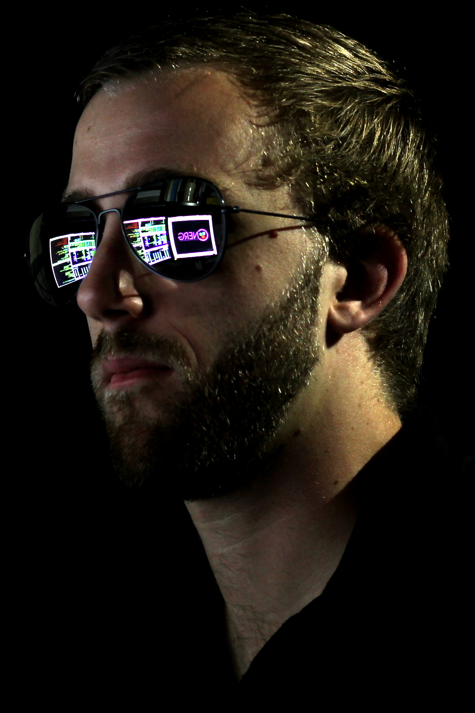
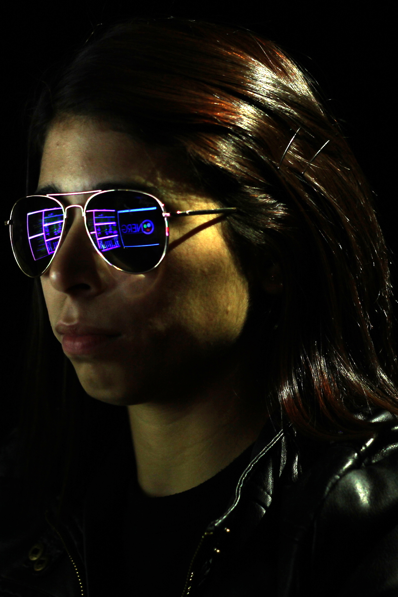
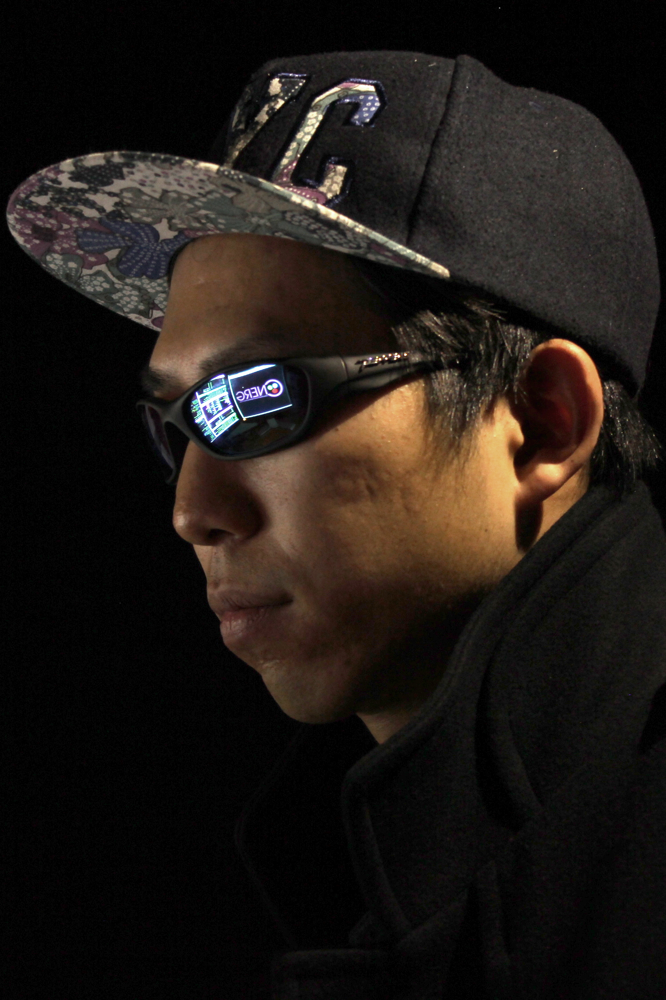
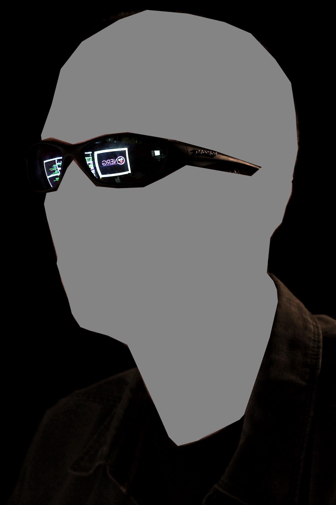

Staff and Students
==========================

Research Staff
--------------

+---------------------------------+---------------------------------+---------------------------------+
| |pphw_img|                      | |ad_img|                        | |bam_img|                       |
|                                 |                                 |                                 |
| :doc:`Paul Wilson <pphw>`       | :doc:`Andrew Davis <adavis>`    | :doc:`Baptiste Mouginot <bam>`  |
|                                 |                                 |                                 |
| Professor, CNERG leader         | Scientist                       | Scientist                       |
+---------------------------------+---------------------------------+---------------------------------+

.. |ad_img| image:: hacker_davis.JPG
             :width: 100

.. |bam_img| image:: hacker_mouginot.JPG
              :width: 100

Graduate Students
-----------------

+------------------------------------+------------------------------------+----------------------------------+--------------------------------+---------------------------------------+
| |cad_img|                          | |pcs_img|                          | |ljj_img|                        | |mh_img|                       | |ao_img|                              |
|                                    |                                    |                                  |                                |                                       |  
| :doc:`Chelsea D'Angelo <dangelo>`  | :doc:`Patrick Shriwise <shriwise>` | :doc:`Lucas Jacobson <jacobson>` |  :doc:`Moataz Harb <mharb>`    | :doc:`Arrielle Opotowsky <opotowsky>` |  
+------------------------------------+------------------------------------+----------------------------------+--------------------------------+---------------------------------------+
| |kk_img|                           |  |ng_img|                          | |yp_img|                         | |sel_img|                      |                                       |
|                                    |                                    |                                  |                                |                                       |
| :doc:`Kalin Kiesling <kiesling>`   | :doc:`Nancy Granda-Duarte <granda>`| :doc:`YoungHui Park <park>`      |  :doc:`Owen Selles <selles>`   |                                       |
+------------------------------------+------------------------------------+----------------------------------+--------------------------------+---------------------------------------+

.. toctree::
   :maxdepth: 1
   :hidden:

   pphw
   adavis
   bam
   dangelo
   shriwise
   jacobson
   mharb
   opotowsky
   kiesling
   granda
   park
   selles
   ejwilson3
   aaswenson
   leschultz
      
.. |cad_img| image:: hacker_dangelo.JPG
             :width: 100

	    

.. |mh_img| image:: hacker_harb.JPG
             :width: 100

Undergraduate Students & Interns
---------------------------------

+------------------------------------+------------------------------------+------------------------------------+
|                                    |                                    |                                    |
|                                    |                                    |                                    |
| :doc:`Ellis Wilson <ejwilson3>`    | :doc:`Alex Swenson <aaswenson>`    | :doc:`Lane Schultz <leschultz>`    |
+------------------------------------+------------------------------------+------------------------------------+

Employment Opportunties
-----------------------------

None at this time.

Alumni
-------------
* `Tae Wook Ahn <http://www.oaep.go.th/index_en.php>`_, MS(2010), Exelon Nuclear
* Elliott Biondo, PhD(2016), `Oak Ridge National Laboratory <http://www.ornl.gov>`_
* Geoff Bull, MS(2005), US Army
* Robert Carlsen, PhD(2016), `Idaho National Laboratory <http://www.inl.gov>`_
* Kerry Dunn, PhD(2014), `Sandia National Laboratories (Albuquerque) <http://www.sandia.gov>`_
* Eric Edwards, PhD(2007), `Shine Medical Technologies <http://shinemed.com>`_
* `Matthew Gidden <http://www.mattgidden.com>`_, PhD(2015), `International Institute for Applied Systems Analysis (IIASA) <http://www.iiasa.ac.at/>`_
* Ryan Grady, MS(2008), Exelon
* Po Hu, PhD(2008), Shanghai Jiaotong Unviersity
* `Katy Huff <http://katyhuff.github.io/>`_, PhD(2013), `U. Illinois at Urbana-Champaign <http://npre.illinois.edu/>`_
* Paul Humrickhouse, MS(2005), `Idaho National Laboratory <http://www.inl.gov>`_
* `Brian Kiedrowski <http://www.engin.umich.edu/ners/people/faculty/brian-kiedrowski>`_, PhD(2009), University of Michigan
* `Matthew Klebenow <Knolls Atomic Power Laboratory>`_, BSEP(2013), EPIC Systems
* `Ahmad Ibrahim <https://www.linkedin.com/pub/ahmad-ibrahim/13/585/161>`_, PhD(2012), `Oak Ridge National Laboratory <http://www.ornl.gov>`_
* Steven Jackson, Programmer
* Meghan McGarry, Scientist (2014-2017), `Lawrence Livermore National Laboratory <http://www.llnl.gov>`_
* Courtlan McLay, Programmer (2015)
* Damien Moule, MS(2011)
* Phiphat Phruksarojanakun, PhD(2007), Thai `Office of Atoms for Peace <http://www.oaep.go.th/index_en.php>`_
* `Kyle Oliver <http://www.kyleoliver.net/>`_, MS(2009) 
* `Tracy Radel <https://www.linkedin.com/pub/tracy-radel/24/6b7/495>`_, MS(2007), `Shine Medical Technologies <http://shinemed.com>`_
* Olzhas Rakhimov, Research Support (2013-2014)
* `Eric Relson <http://hackaday.io/hacker/614-gertlex>`_, MS(2013)
* `Jeremy Roberts <http://www.mne.ksu.edu/people/faculty/roberts>`_, MS(2009), `Kansas State Univeristy <http://www.ksu.edu>`_
* Ben Schmitt, MS(2006), Global Nuclear Fuels
* `Andy Scholbrock <https://www.linkedin.com/pub/eric-relson/12/4a7/538>`_, BS(2009), `National Renewable Energy Laboratory <http://www.nrel.gov>`_
* Anthony Scopatz, Scientist (2013-2015), `University of South Carolina <http://www.me.sc.edu/nuclear/academics.html>`_
* `Tim Setter <https://www.linkedin.com/pub/tim-setter/92/254/552>`_, MS(2007), Tennesse Valley Authority
* `Stuart Slattery <http://www.csm.ornl.gov/newsite/cees.html>`_, PhD(2013), `Oak Ridge National Laboratory <http://www.ornl.gov>`_
* `Rachel Slaybaugh <https://www.nuc.berkeley.edu/people/rachel-slaybaugh>`_, PhD(2012), U. California-Berkeley
* Brandon Smith, PhD(2011), `Los Alamos National Laboratory <http://www.lanl.gov>`_
* `Patrick Snouffer <https://www.linkedin.com/pub/patrick-snouffer/11/8a5/594>`_, MS(2011), `Sandia National Laboratories <http://www.sandia.gov>`_
* Chris Staum, MS(2006), `Exelon <http://www.exeloncorp.com>`_
* Zach Welch, Research Support (2013-2015), Amazon
* John Xia, Research Staff (2014-2015)
* Julie Zachman, Programmer (2013-2015), UW-Madison

